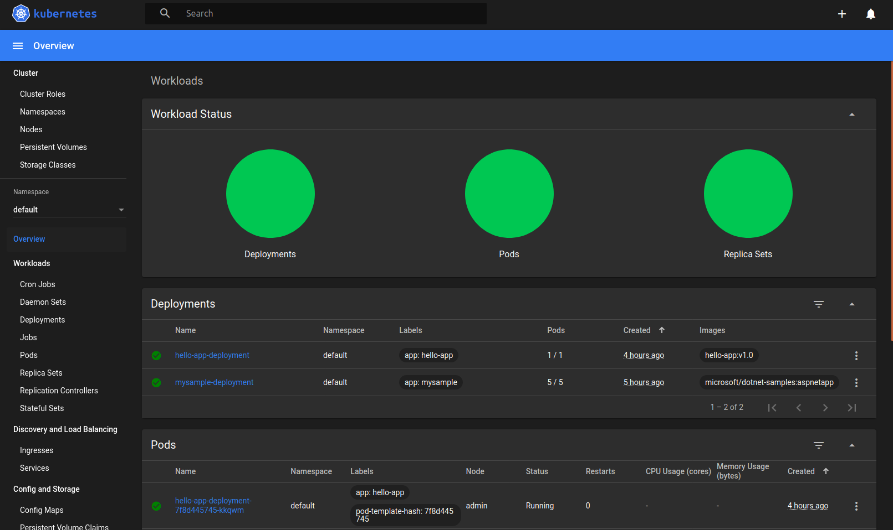

# Setting up and Deploying Containerized Golang Application on Kubernetes.


**Requirements** :
- Docker 

## Setting up Kubernetes
### Installing Kubectl
1. Download the latest release

```sh 
curl -LO https://storage.googleapis.com/kubernetes-release/release/`curl -s https://storage.googleapis.com/kubernetes-release/release/stable.txt`/bin/linux/amd64/kubectl
```

2. Make the kubectl binary executable.

```sh
chmod +x ./kubectl
```

3. Move the binary in to your PATH.

```sh
sudo mv ./kubectl /usr/local/bin/kubectl
```

4. Test if the installation was successful.

```sh
kubectl version
```
Following message will appear : 
```
The connection to the server localhost:8080 was refused - did you specify the right host or port?
```

### Setting up Minikube

Minikube allows a local single node deployment on Kubernetes.

1. Minikube Direct Download
```sh
curl -Lo minikube https://storage.googleapis.com/minikube/releases/latest/minikube-linux-amd64 \
  && chmod +x minikube
```
2. Add Minikube to path 
```sh
sudo mkdir -p /usr/local/bin/
sudo install minikube -D /usr/local/bin/
```

### Installing additional dependencies 

Starting minikube for the first time will trigger some configurations : 
```sh
minikube start --vm-driver=none
```

### Activate dashboard

```sh
minikube dashboard 
```
Then Visit : 
**http://127.0.0.1:46337/api/v1/namespaces/kubernetes-dashboard/services/http:kubernetes-dashboard:/proxy/**




**Problem** : A token is asked to access the dashboard.
Here's the solution : 
```sh
kubectl -n kube-system get secret
```
output : 
```
NAME                                             TYPE                                  DATA   AGE
attachdetach-controller-token-n7rdp              kubernetes.io/service-account-token   3      9m50s
bootstrap-signer-token-z7q6q                     kubernetes.io/service-account-token   3      9m52s
bootstrap-token-fzpgnq                           bootstrap.kubernetes.io/token         6      9m54s
certificate-controller-token-tzkd4               kubernetes.io/service-account-token   3      9m54s
clusterrole-aggregation-controller-token-4sqrj   kubernetes.io/service-account-token   3      9m52s
coredns-token-v5b55                              kubernetes.io/service-account-token   3      9m54s
cronjob-controller-token-qvlz7                   kubernetes.io/service-account-token   3      9m55s
daemon-set-controller-token-d9s9p                kubernetes.io/service-account-token   3      9m54s
default-token-pb6bm                              kubernetes.io/service-account-token   3      9m48s
deployment-controller-token-vstrw                kubernetes.io/service-account-token   3      9m55s
disruption-controller-token-zb5sx                kubernetes.io/service-account-token   3      9m55s
endpoint-controller-token-w6g8p                  kubernetes.io/service-account-token   3      9m55s
endpointslice-controller-token-qm2kx             kubernetes.io/service-account-token   3      9m54s
expand-controller-token-pts65                    kubernetes.io/service-account-token   3      9m53s
generic-garbage-collector-token-dgmdd            kubernetes.io/service-account-token   3      9m53s
horizontal-pod-autoscaler-token-bwrfj            kubernetes.io/service-account-token   3      9m49s
job-controller-token-rf6qk                       kubernetes.io/service-account-token   3      9m51s
kube-proxy-token-ngz4l                           kubernetes.io/service-account-token   3      9m54s
kubernetes-dashboard-certs                       Opaque                                0      5m1s
kubernetes-dashboard-key-holder                  Opaque                                2      4m19s
kubernetes-dashboard-token-lvv69                 kubernetes.io/service-account-token   3      5m1s
namespace-controller-token-z6j69                 kubernetes.io/service-account-token   3      9m54s
node-controller-token-k6fts                      kubernetes.io/service-account-token   3      9m53s
persistent-volume-binder-token-nx5lp             kubernetes.io/service-account-token   3      9m50s
pod-garbage-collector-token-tzpgk                kubernetes.io/service-account-token   3      9m55s
pv-protection-controller-token-hpm7q             kubernetes.io/service-account-token   3      9m55s
pvc-protection-controller-token-tdrbz            kubernetes.io/service-account-token   3      9m49s
replicaset-controller-token-5wh5s                kubernetes.io/service-account-token   3      9m55s
replication-controller-token-8x45n               kubernetes.io/service-account-token   3      9m51s
resourcequota-controller-token-v7ts2             kubernetes.io/service-account-token   3      9m52s
service-account-controller-token-dldhj           kubernetes.io/service-account-token   3      9m49s
service-controller-token-rpkbg                   kubernetes.io/service-account-token   3      9m49s
statefulset-controller-token-ql46c               kubernetes.io/service-account-token   3      9m51s
storage-provisioner-token-k7txv                  kubernetes.io/service-account-token   3      9m53s
token-cleaner-token-zq5sh                        kubernetes.io/service-account-token   3      9m52s
ttl-controller-token-r5qpb                       kubernetes.io/service-account-token   3      9m50s
```

Get the token on the right service : 
```sh
kubectl -n kube-system describe secret deployment-controller-token-XXXXX
```

## Creating a simple Golang Application

Here's a simple Golang code to mimic a microservice with a GET - Request :
```go
package main

import (
    "fmt"
    "net/http"
)

func main(){
    // 
    handler := http.NewServeMux()
    handler.HandleFunc("/api/hello", Hello)
    // Emit on all interfaces.
    http.ListenAndServe("0.0.0.0:8080", handler)
}

func Hello(w http.ResponseWriter, r *http.Request){
    fmt.Fprintf(w, "Hello World!")
}
```

ServeMux is an HTTP request multiplexer. It’s responsible for matching the URL in the request to an appropriate handler and executing it. 

## Put the Golang Program in a Container.

The following Dockerfile will put the program in a container : 

```docker 
FROM golang:1.13-alpine AS build

WORKDIR /src/
COPY main.go go.* /src/

RUN CGO_ENABLED=0 go build -o /bin/hello 

FROM scratch
COPY --from=build /bin/hello /bin/hello
ENTRYPOINT ["/bin/hello"]
```

Build it with : 

```sh 
docker build -f dockerfile/Dockerfile -t hello-app:v1.0 .
```

## Deploy the Container to Kubernetes.

A script is composed of the number of replicas, the target port, the container we have to push to the K8s cluster, etc. as follows : 

```yaml
apiVersion: apps/v1
kind: Deployment
metadata:
  name: hello-app-deployment
  labels:
    app: hello-app
spec:
  replicas: 1
  selector:
    matchLabels:
      app: hello-app
  template:
    metadata:
      labels:
        app: hello-app
    spec:
      containers:
        - name: hello-app
          image: hello-app:v1.0
          ports:
            - containerPort: 8080
```

We deploy it to Kubernetes with the command : 
```sh
kubectl create -f hello-app-deployment.yaml 
```

To delete the app : 
```sh
kubectl delete -f hello-app-deployment.yaml
```

To replace the app with a modified yaml file :
```sh
kubectl replace -f hello-app-deployment.yaml
```

## Performing Requests on the deployed app.

After the app is deployed on Kubernetes, a port forwarding is required : 

```sh
kubectl port-forward hello-app-deployment-XXXXXXXX-xxxxx 8080:8080
```

Then we can make requests by accessing the url on the browser or by the terminal with : 

```sh 
curl -i -v localhost:8080/api/hello
```

Output : 

```
*   Trying 127.0.0.1...
* TCP_NODELAY set
* Connected to localhost (127.0.0.1) port 8080 (#0)
> GET /api/hello HTTP/1.1
> Host: localhost:8080
> User-Agent: curl/7.58.0
> Accept: */*
> 
< HTTP/1.1 200 OK
HTTP/1.1 200 OK
< Date: Sat, 29 Aug 2020 21:23:43 GMT
Date: Sat, 29 Aug 2020 21:23:43 GMT
< Content-Length: 12
Content-Length: 12
< Content-Type: text/plain; charset=utf-8
Content-Type: text/plain; charset=utf-8

< 
* Connection #0 to host localhost left intact


Hello World!%       
```


